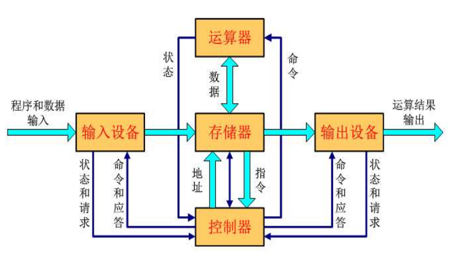

# week one 计算机系统架构概论

## 冯诺依曼架构

冯·诺依曼结构**最重要**的思想是“**存储程序(Stored-program)**” 

### 工作方式

任何要计算机完成的工作都需要的过程：

- 被编写成程序
- 然后将程序和原始 数据送入主存并启动执行
- 一旦程序被启动，计算机应能在不需操 作人员干预下，自动完成逐条取出指令和执行指令的任务 

### 主要思想

1. 计算机应由**运算器、控制器、存储器、输入设备和输出设备** 五个基本部件组成。 
2. 各基本部件的功能是： 
   - **存储器**不仅能存放数据，而且也能存放指令，**形式上两者没有区别**，但计算机应能区分数据还是指令； 